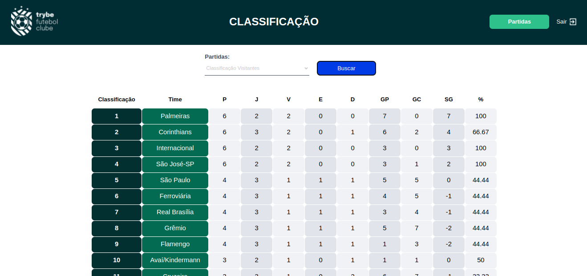

_Bem vinda(o)!!_

# Trybe Futebol Clube 🏆

# Habilidades

O `TFC` é um site informativo sobre partidas e classificações de futebol! ⚽️

No time de desenvolvimento do `TFC`, eu fiquei responsável por desenvolver uma API (utilizando o método `TDD`) e também integrar *- através do docker-compose -* as aplicações para que funcionem consumindo um banco de dados.

Nesse projeto, eu construí **um back-end dockerizado utilizando modelagem de dados através do Sequelize**. Meu desenvolvimento **respeitou as regras de negócio** providas no projeto e **minha API ficou apta para ser consumida por um front-end já provido nesse projeto**. Eu fui capaz de:

 - Realizar a dockerização dos apps, network, volume e compose;
 - Modelar dados com **MySQL** através do **Sequelize**;
 - Criar e associar tabelas usando `models` do `sequelize`;
 - Construir uma **API REST** com endpoints para consumir os models criados;
 - Fazer um `CRUD` utilizando `ORM`;

# Requisitos 
</img>

           
Links úteis

           <a href="https://docs.docker.com/engine/reference/commandline/exec/">- getting in container with `docker exec`</a>  
           <a href="https://sequelize.org/docs/v6/other-topics/naming-strategies/#the-underscored-option">-  underscored sequelize options </a>
 
           <a href="https://sequelize.org/docs/v6/other-topics/migrations/#migration-skeleton">-  use `references` to specify a foreign key on migrations settings </a>
 
           <a href="https://sequelize.org/docs/v6/core-concepts/assocs/#implementation-2">-   associations sequelize model implements</a>  
           
            
            
              

 

##   Sequelize 
- [x] 00 - SETUP INICIAL [commit](https://github.com/italosergio/trybe-futebol-clube/commit/7c26424c0cc5ddadd6d3cbb1b50ebdba30519d74)
</img>
- [x] 01 - Migrations tabela de **`users`** [commit](https://github.com/italosergio/trybe-futebol-clube/commit/7c26424c0cc5ddadd6d3cbb1b50ebdba30519d74)
- [x] 02 - Migrations tabela de **`teams`** [commit](https://github.com/italosergio/trybe-futebol-clube/commit/7c26424c0cc5ddadd6d3cbb1b50ebdba30519d74)
- [x] 03 - Migrations tabela de **`matches`** [commit](https://github.com/italosergio/trybe-futebol-clube/commit/7c26424c0cc5ddadd6d3cbb1b50ebdba30519d74)

##   Login 

- [x] 04 - `(TDD)` Cobertura de testes, 5% dos arquivos e 7 linhas de código [commit](https://github.com/italosergio/trybe-futebol-clube/commit/7cebf58a89ba39372b48a326f10123b37a6f0ab9)
- [x] 05 - Endpoint POST **`/login`** [commit](https://github.com/italosergio/trybe-futebol-clube/commit/d631da9a015ff7c977df773569cdcd2225001fa6)
- [x] 06 - `(TDD)` Cobertura de testes, 10% dos arquivos e 19 linhas de código [commit](https://github.com/italosergio/trybe-futebol-clube/commit/7cebf58a89ba39372b48a326f10123b37a6f0ab9) 
- [x] 07 - Validação do `email`, formato de escrita [commit](https://github.com/italosergio/trybe-futebol-clube/commit/f572e5dbc5367c497db9f4b81afc95db52c24299)
- [x] 08 - `(TDD)` Cobertura de testes, 15% dos arquivos e 25 linhas de código [commit](https://github.com/italosergio/trybe-futebol-clube/commit/7cebf58a89ba39372b48a326f10123b37a6f0ab9) 
- [x] 09 - Validação da `senha`, cruzamento com senha do banco [commit](https://github.com/italosergio/trybe-futebol-clube/commit/ffb0381fcee6a080350b9838d19625f730c8a78a) 
- [x] 10 - `(TDD)` Cobertura de testes, 20% dos arquivos e 35 linhas de código [commit](https://github.com/italosergio/trybe-futebol-clube/commit/7cebf58a89ba39372b48a326f10123b37a6f0ab9) 
- [x] 11 - Validação do `email`, campo vazio [commit](https://github.com/italosergio/trybe-futebol-clube/commit/be89c15f2c9502f88934e2764ae1571775232c2a)
- [x] 12 - `(TDD)` Cobertura de testes, 30% dos arquivos e 45 linhas de código [commit](https://github.com/italosergio/trybe-futebol-clube/commit/1cf2cddf0161bde21325b7caec6b15d08c354a8a)
- [x] 13 - Validação da `senha`, campo vazio [commit](https://github.com/italosergio/trybe-futebol-clube/commit/1c81f7136e54c2bbb0f4613ba280d387acd142cf)
- [x] 14 - Endpoint GET **`/login/validate`**, autentica o token e retorna privilegio do usuário [commit](https://github.com/italosergio/trybe-futebol-clube/commit/c2021ebd1bc2788268c67fd3d2bbbac44daf063d)

##   Jogos

- [x] 15 - `(TDD)` Cobertura de testes, 45% dos arquivos e 70 linhas de código [commit](https://github.com/italosergio/trybe-futebol-clube/commit/1cf2cddf0161bde21325b7caec6b15d08c354a8a)
- [x] 16 - Endpoint GET **`/teams`**, retorna os times [commit](https://github.com/italosergio/trybe-futebol-clube/commit/d9e8e2802633c485b47819c6b7382a3412727621) [commit](https://github.com/italosergio/trybe-futebol-clube/commit/209838d4c80ca3316a233cc1bbb687b88e2e7a0a)
- [x] 17 - Endpoint GET **`/teams/:id`**, retorna um time especifico [commit](https://github.com/italosergio/trybe-futebol-clube/commit/90f5c48278af6ca1b798b510181f530e7bc93242) [commit](https://github.com/italosergio/trybe-futebol-clube/commit/a4383a8798fa56bdde321f31f74b212f82e74230)
- [x] 18 - `(TDD)` Cobertura de testes, 60% dos arquivos e 80 linhas de código [commit](https://github.com/italosergio/trybe-futebol-clube/commit/c49ed234ab87cb1421725647a90bfafc9ec8a795)
- [x] 19 - Endpoint GET **`/matches`**, retorna as partidas [commit](https://github.com/italosergio/trybe-futebol-clube/commit/b1988930bf68be2616b994b15c1e84df56a0984a) [commit](https://github.com/italosergio/trybe-futebol-clube/commit/1d5c83bcbd46b5558450808395913624a0498830)
- [x] 20 - Endpoint GET **`/matches?inProgress=true`**, filtra as partidas em andamento [commit](https://github.com/italosergio/trybe-futebol-clube/commit/fff81e0ccb864aded8641b546f0c2d6436fc22ca)
- [x] 21 - Endpoint GET **`/matches?inProgress=false`**, filtra as partidas em finalizadas [commit](https://github.com/italosergio/trybe-futebol-clube/commit/fff81e0ccb864aded8641b546f0c2d6436fc22ca)

##   Adicionar Partidas

- [x] 22 - 🚀 `(TDD)` Cobertura de testes, 80% dos arquivos e 100 linhas de código [commit](https://github.com/italosergio/trybe-futebol-clube/commit/8b7ad513c589681a0143cd551d973e41bfa5d86c)
- [x] 23 - Endpoint POST **`/matches`**, registra uma partida [commit](https://github.com/italosergio/trybe-futebol-clube/commit/a11aab7ed9d34728ed420b490ecfc8225c9f75b5)
- [x] 24 - Endpoint PATCH **`/matches/:id/finish`**, atualiza _inProgress_ da partida para `false` [commit](https://github.com/italosergio/trybe-futebol-clube/commit/051b84537ceb504c3fd1267b1dc341f7ee5da3f6)
- [x] 25 - Endpoint **`/matches`**, restringe registro de partida para times iguais [commit](https://github.com/italosergio/trybe-futebol-clube/commit/e4920bea9d7b3b7f676cba0e6f0060c0d7f3475e)
- [x] 26 - Endpoint **`/matches`**, restringe registro de partida para times que não existem [commit](https://github.com/italosergio/trybe-futebol-clube/commit/3dd235f166a8c87e922782293b0940ea79962334)

##   Editar Partidas

- [x] 27 - Endpoint PATCH **`/matches/:id`**,  atualiza uma partida em andamento [commit](https://github.com/italosergio/trybe-futebol-clube/commit/e8010a62b8ed5899da8c1577012c5693f7a43513) [commit](https://github.com/italosergio/trybe-futebol-clube/commit/cf1c1a2d9daf83e06a7cab5aff482b9643210d66)
- [x] 28 - Endpoint **`/matches/:id`**,  finaliza uma partida em andamento [commit](https://github.com/italosergio/trybe-futebol-clube/commit/051b84537ceb504c3fd1267b1dc341f7ee5da3f6)
 
##   Leaderboard Home
</img>
- [x] 29 - Endpoint **`/leaderboard/home`**, filtra a classificações dos times da casa;
- [x] 30 - Endpoint **`/leaderboard/home`**, atualiza a classificações dos times da casa;

##   Leaderboard away

- [x] 31 - Endpoint **`/leaderboard/away`**, filtra a classificações dos times de fora;
- [x] 32 - Endpoint **`/leaderboard/away`**, atualiza a classificações dos times de fora;

##   Leaderboard

- [x] 33 - Endpoint **`/leaderboard`**, filtra a classificações geral dos times;
- [x] 34 - Endpoint **`/leaderboard`**, atualiza a classificações geral dos times ao inserir Flamengo 3 X 0 Napoli-SC;
- [x] 35 - Endpoint **`/leaderboard`**, atualiza a classificações geral dos times ao inserir Minas Brasília 1 X 0 Ferroviária;

##

</img>

